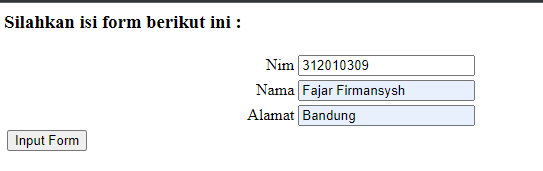
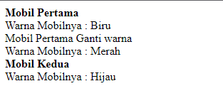

# Lab 10 Web OOP

### Membuat From_input.php

      <?php

      include "form.php";

      echo "<html><head><title>Mahasiswa</title></head><body>";
      $form = new Form("","Input Form");
      $form->addField("txtnim", "Nim");
      $form->addField("txtnama", "Nama");
      $form->addField("txtalamat", "Alamat");
      echo "<h3>Silahkan isi form berikut ini :</h3>";
      $form->displayForm();
      echo "</body></html>";

      ?>

### Membuat From.php

      <?php

      /**
       * Nama Class: Form
       * Deskripsi: CLass untuk membuat form inputan text sederhan
       **/
      class Form
      {
        private $fields = array();
        private $action;
        private $submit = "Submit Form";
        private $jumField = 0;
        public function __construct($action, $submit)
        {
          $this->action = $action;
          $this->submit = $submit;
        }
        public function displayForm()
        {
          echo "<form action='" . $this->action . "' method='POST'>";
          echo '<table width="100%" border="0">';
          for ($j = 0; $j < count($this->fields); $j++) {
            echo "<tr><td align='right'>" . $this->fields[$j]['label'] . "</td>";
            echo "<td><input type='text' name='" . $this->fields[$j]['name'] . "'></td></tr>";
          }
          echo "<tr><td colspan='2'>";
          echo "<input type='submit' value='" . $this->submit . "'></td></tr>";
          echo "</table>";
        }
        public function addField($name, $label)
        {
          $this->fields[$this->jumField]['name'] = $name;
          $this->fields[$this->jumField]['label'] = $label;
          $this->jumField++;
        }
      }

### Membuat From Mobil

      <?php

      class mobil{
        private $warna;
        private $merk;
        private $harga;

        public function __construct()
        {
          $this->warna = "Biru";
          $this->merk = "BMW";
          $this->harga = "10000000";
        }

        public function gantiwarna ($warnaBaru){
          $this->warna = $warnaBaru;
        }

        public function tampilwarna(){
          echo "Warna Mobilnya : " . $this->warna;
        }
      }

      // Membuat Objek Mobil
      $a = new Mobil();
      $b = new Mobil();

      // Memanggil Objek;
      echo "<b> Mobil Pertama </b> ";
      $a->tampilwarna();

      echo "  Mobil Pertama Ganti warna ";
      $a->gantiwarna("Merah");
      $a->tampilwarna();
      // Mengganti Objek
      echo " <b>Mobil Kedua</b> ";
      $b->gantiwarna("Hijau");
      $b->tampilwarna();

      ?>

